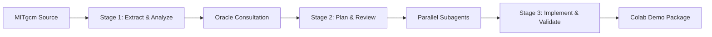

# 3-Stage Fortran → Kokkos Modernization Workflow

## Overview

This document describes the systematic 3-stage approach for modernizing Fortran algorithms from MITgcm to high-performance Kokkos C++ implementations. The workflow emphasizes Oracle-guided planning, parallel execution, and comprehensive validation.

## Stage Architecture



## Stage 1: Extract & Analyze

### Purpose
Establish algorithmic understanding and performance baselines from MITgcm Fortran source code.

### Key Activities

#### 1. Fortran Routine Extraction
```bash
tools/extract_fortran_routine.sh --routine SOLVE_TRIDIAGONAL --output stage1/extract/
```

**Deliverables**:
- `solve_tridiagonal.f90` - Extracted standalone routine
- `driver.f90` - Test driver with CLI interface

#### 2. Algorithm Documentation
```bash
# Agent with stage1_explain_prompt.md analyzes the extracted routine
```

**Deliverables**:
- `stage1/docs/algorithm_explanation.md` - Mathematical and computational analysis
- `stage1/docs/performance_analysis.md` - Scaling and complexity characterization

#### 3. Performance Baseline Establishment
```bash
tools/run_fortran.sh --src stage1/extract/driver.f90 --n 1024 --reps 5 --out stage1/baselines/fortran_baseline.csv
```

**Deliverables**:
- `stage1/baselines/fortran_baseline.csv` - Performance measurements across problem sizes
- Numerical validation reference data

### Success Criteria
- [ ] Algorithm complexity and characteristics documented
- [ ] Fortran baseline performance established across test sizes [64, 256, 1024, 4096]
- [ ] CSV output format standardized: `algorithm,implementation,N,reps,time_ms,gflops`
- [ ] Mathematical foundations clearly explained
- [ ] Parallelization opportunities identified

## Stage 2: Plan & Review

### Purpose
Generate expert-level modernization strategy through Oracle consultation and comprehensive transition planning.

### Key Activities

#### 1. Oracle Consultation
```bash
tools/consult_oracle.sh --algorithm tridiag_thomas --stage1-dir algorithms/tridiag_thomas/stage1 --output stage2/plan/transition_plan.md
```

**Oracle Analysis Areas**:
- Memory layout optimization for GPU coalescing
- Parallelization strategy and execution policies
- Performance bottleneck identification
- Numerical validation framework design
- Cross-backend portability considerations

**Deliverables**:
- `stage2/plan/transition_plan.md` - Comprehensive modernization roadmap
- Kokkos::View layout specifications
- Execution policy recommendations
- Performance optimization priorities

#### 2. Parallel Task Decomposition
```bash
tools/spawn_subagents.sh --algorithm tridiag_thomas --stage2-dir algorithms/tridiag_thomas/stage2 --max-agents 4
```

**Subagent Tasks**:
- **translate_core**: Core algorithm Kokkos translation
- **optimize_memory**: Memory layout and access pattern optimization
- **implement_timing**: Performance measurement infrastructure
- **add_validation**: Numerical correctness verification framework

**Deliverables**:
- Parallel task prompts for specialized agents
- Coordinated implementation strategy
- Load balancing across translation tasks

### Success Criteria
- [ ] Oracle transition plan provides implementable guidance
- [ ] Memory layouts optimized for target backends
- [ ] Parallelization strategy preserves algorithm semantics  
- [ ] Performance targets defined and achievable
- [ ] Subagent task decomposition enables parallel execution

## Stage 3: Implement & Validate

### Purpose
Execute Oracle-guided implementation with comprehensive validation and production packaging.

### Key Activities

#### 1. Kokkos Implementation
Following Stage 2 transition plan specifications:

```cpp
// Memory layout per Oracle recommendations
using array_1d_t = Kokkos::View<double*>;
using const_array_1d_t = Kokkos::View<const double*>;

// Execution policies per parallelization strategy
using exec_policy = Kokkos::RangePolicy<>;
```

**Implementation Standards**:
- Modern C++17 compatible code
- Kokkos::fence() before timing measurements
- Comprehensive error handling
- Cross-backend portability

#### 2. Build System Integration
```bash
tools/build_kokkos.sh --kernel tridiag_thomas --backend openmp
tools/build_kokkos.sh --kernel tridiag_thomas --backend cuda
```

**Deliverables**:
- CMake build configuration
- Multi-backend compilation support
- Clean builds without warnings

#### 3. Comprehensive Validation Pipeline

##### Numerical Correctness
```bash
python3 tools/compare_outputs.py --fortran stage1/baselines/fortran_baseline.csv --kokkos stage3/validate/kokkos_results.csv --tol 1e-10
```

**Validation Requirements**:
- max_abs_diff ≤ 1e-10 vs Fortran baseline
- All test sizes validation: [64, 256, 1024, 4096]
- Boundary condition verification
- Edge case handling

##### Performance Verification
```bash
tools/run_kokkos.sh --kernel tridiag_thomas --n 1024 --reps 5
```

**Performance Targets**:
- Within ±5% of Fortran baseline
- Expected GPU acceleration where applicable
- Memory bandwidth utilization ≥80% of peak
- Proper scaling with problem size

#### 4. Production Package Generation
```bash
tools/prepare_colab_package.sh --algorithm tridiag_thomas --stage-file algorithms/tridiag_thomas/stage.yml
```

**Deliverables**:
- Interactive Jupyter notebook for Google Colab
- Side-by-side performance comparison
- Educational modernization content
- Executable demonstration materials

### Success Criteria
- [ ] Complete functional equivalence with Fortran implementation
- [ ] Numerical results identical within 1e-10 tolerance
- [ ] Performance competitive with baseline measurements
- [ ] Clean compilation across OpenMP, CUDA, and HIP backends
- [ ] Production-ready Colab demonstration package

## Workflow Orchestration

### Stage.yml Configuration
Each algorithm maintains metadata and build specifications:

```yaml
name: tridiag_thomas
description: "MITgcm tridiagonal solver using Thomas algorithm"

validation:
  tolerance: 1e-10
  test_sizes: [64, 256, 1024, 4096]
  backends: ["openmp", "cuda"]

stages:
  stage1:
    targets: [extract, explain, baseline]
  stage2:
    targets: [plan, review]
  stage3:
    targets: [implement, validate, package_colab]
```

### Quality Gates

#### Stage 1 → Stage 2 Transition
- Fortran routine successfully extracted and validated
- Performance baselines established across all test sizes
- Algorithm documentation complete and technically accurate

#### Stage 2 → Stage 3 Transition  
- Oracle transition plan provides implementable guidance
- Subagent task decomposition completed
- Performance targets defined and realistic

#### Stage 3 Completion
- Numerical validation passes all test cases
- Performance targets achieved within acceptable bounds
- Production package ready for deployment

## Error Handling & Recovery

### Common Issues & Resolutions

#### Stage 1 Issues
- **Extraction Failures**: Missing MITgcm dependencies → Use simplified test cases
- **Baseline Inconsistency**: System-specific performance variation → Document platform considerations

#### Stage 2 Issues
- **Oracle Plan Infeasibility**: Overly aggressive optimization targets → Conservative fallback strategies
- **Subagent Coordination**: Task dependency conflicts → Sequential execution fallback

#### Stage 3 Issues
- **Numerical Divergence**: Precision loss in translation → Enhanced validation and debugging
- **Performance Regression**: Suboptimal Kokkos patterns → Oracle re-consultation and optimization

## Best Practices

### Code Quality
- Follow consistent naming conventions between Fortran and Kokkos
- Maintain clear separation between algorithm logic and performance infrastructure
- Use modern C++ features judiciously for maintainability

### Numerical Stability
- Conservative tolerance bounds for validation (1e-10)
- Multiple test cases with different conditioning
- Explicit handling of edge cases and boundary conditions

### Performance Optimization
- Profile-guided optimization based on actual measurements
- Oracle guidance prioritization over speculative optimizations
- Cross-platform validation for portability

### Documentation Standards
- Technical accuracy suitable for HPC practitioners
- Code examples for critical implementation decisions
- Performance analysis with quantitative results

## Integration with Amp Ecosystem

### Subagent Coordination
- Parallel task execution with semaphore-based resource management
- Result aggregation and validation across distributed work
- Error propagation and recovery coordination

### Oracle Integration
- Expert-level consultation at critical decision points
- Performance risk assessment and mitigation strategies
- Code quality review and best practices enforcement

### Educational Content Generation
- Automated Colab notebook generation with interactive demonstrations
- Performance comparison visualizations
- Technical explanation suitable for modernization education

This 3-stage workflow provides systematic, Oracle-guided modernization with comprehensive validation, ensuring high-quality Fortran → Kokkos translations suitable for production HPC environments.
